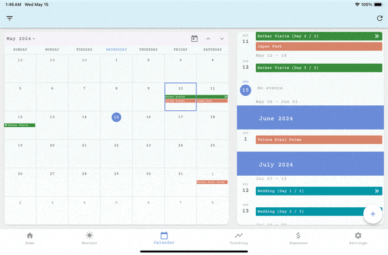

# Multidisplay

The multidisplay app is a Flutter application that works on legacy iOS devices to track habits, manage events, track expenses, and view weather. The app is designed to be an always on dashboard.
 
## Features
{:loop="infinite"}
- Legacy iPad (12.0) support
- Reactive Design for mobile, small tablet, large tablet
- User Authentication
- Weather Forecast + Muddiness Predictor
- Calendar
- System Theming
- Habit Tracking with statuses
- Habit Tracking with start/end tracking 
- Celebrating positive habit tracking 
- (In progress) Expense Tracking
- (In progress) Dog step dashboard
- (In progress) Comprehensive Exercise Dashboard

## Architecture

* Presentation
* BLoC ([Flutter BLoC](https://pub.dev/packages/flutter_bloc))
* Repository
* Data (Firebase Firestore)

Utilizes Cloud Functions for any serverless backend requirements.

## Getting Started

To run this project, the following configuration files need to be setup:
 - lib/firebase_options.dart 
 - ios/firebase_app_id_file.json
 - ios/Runner/GoogleService-Info.plist

## Run
`flutter pub get`

`flutter run`

## Contributing
Any contributions are welcome. This project utilizes [freezed](https://pub.dev/packages/freezed) for code generation and follows linting provided by [very_good_analysis](https://pub.dev/packages/very_good_analysis).

## License
The Multidisplay app is licensed under the [MIT License]().